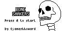

# Bone Shakers!

Bone Shakers is a racing game where skeletons ride unicycles around a dungeon race track. It was designed for the [Arduboy miniature game system](https://www.arduboy.com) as part of the [Unofficial Arduboy game jam of September 2018](https://community.arduboy.com/t/unofficial-game-jam-4-1st-sept-to-the-10th-sep-2018/6254/104). In part inspired by Super Mario Kart for the SNES

## Build instructions
To compile from source you will need the [Arduboy2 library](https://github.com/MLXXXp/Arduboy2) (built against version 4.1.0, latest version appears to have problems?) and the Arduino IDE

Open /Source/BoneShakers/BoneShakers.ino in the Arduino IDE and hit build
